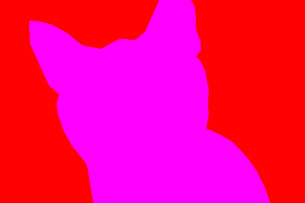

Script for fetching labelled images generated on https://app.labelbox.com/ 

**Example**

Original image             |  Output
:-------------------------:|:-------------------------:
 | 

**Why I made this**
- Images labelled in Labelbox can't be directly exported in bulk; Labelbox's export function generates a JSON file containing URLs to the labelled images, however...
- The labelled images downloaded from are in the form of "masks" with the object of interest in white and the background as transparent

**How this works**
- Parse the JSON file exported from Labelbox to extract image URLs
- Fetch the labelled (and original) images from their URLs
- Change the white/transparent mask to custom colors with OpenCV.

*Instructions:*
1. Export Labelbox labels as JSON file.
2. Put JSON file in ```input``` folder and run ```main.py``` to fetch original images, generate colored-corrected labelled images & generate training.txt
3. Train :)
